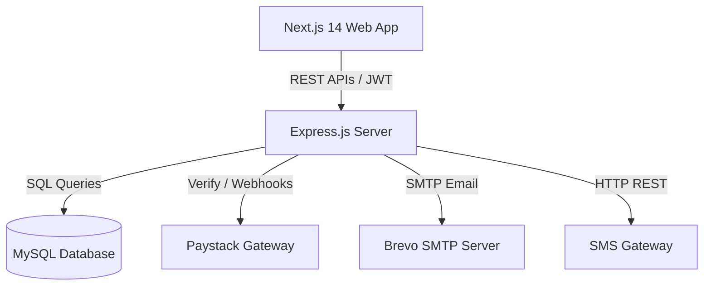
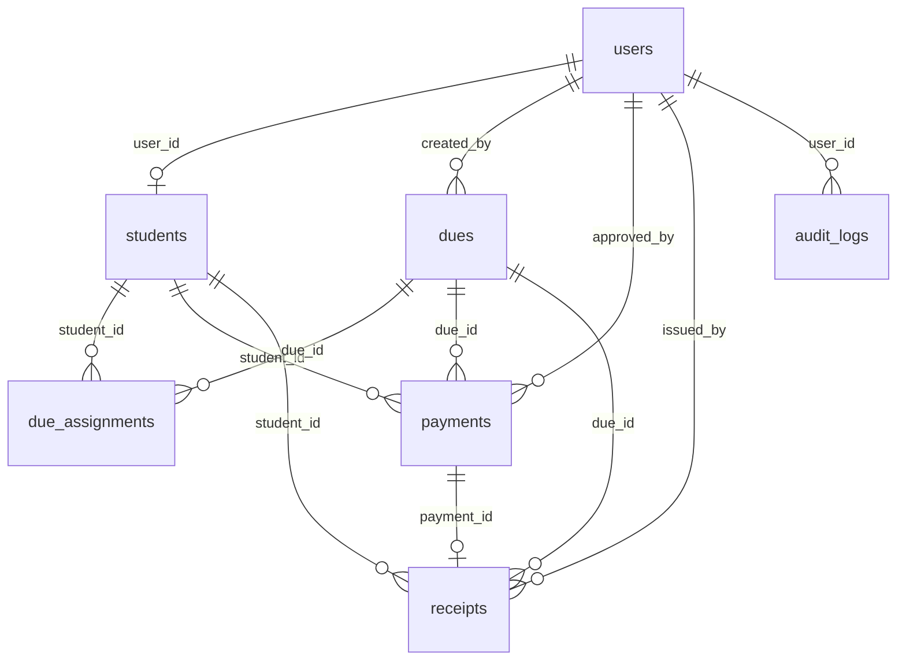
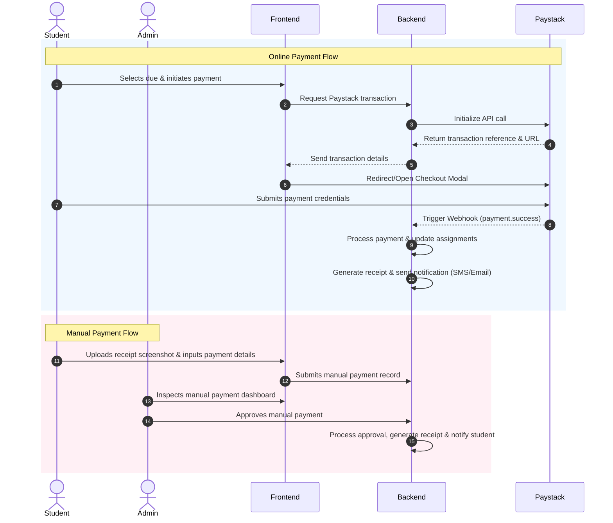

# DuesPay: Departmental Dues Management System
## System Architecture & Technical Documentation

DuesPay is a modern, secure, and transparent digital system designed for managing, collecting, tracking, and reporting departmental dues and fees for students using Ghanaian Cedi (GHS). The system features full automation of online payments via Paystack, a fallback manual payment approval workflow, automatic PDF receipt generation with QR verification codes, and rich visual analytics dashboards for students and administrators.

---

## 1. System Overview & Goals

The primary goal of DuesPay is to eliminate manual bookkeeping and physical receipt tracking in academic departments. By digitizing the payment collection process, the system achieves:
- **Financial Transparency**: Double-entry record keeping via payments and receipts tables with full audit logging of administrative actions.
- **Accurate Tracking**: Easy identification of paid, partially paid, and defaulting students.
- **Improved Convenience**: Support for mobile money (MTN MoMo, Telecel Cash, AT Money) and credit cards through Paystack.
- **Administrative Control**: Custom dues allocation by student level, program, or academic year.

---

## 2. Technology Stack

DuesPay is designed as a split-architecture client-server application:



### Frontend
- **Framework**: Next.js 14 (App Router)
- **Styling**: Tailwind CSS & Vanilla CSS (using global color tokens)
- **Programming Language**: TypeScript
- **State & Contexts**: React Context (`AuthContext` and `BrandingContext`)
- **Visuals**: Recharts (for dynamic dashboards), custom CSS glassmorphic loaders
- **Libraries**: Axios (API requests), `js-cookie` (auth session handling), React Hot Toast

### Backend
- **Framework**: Express.js (Node.js runtime)
- **Database Driver**: `mysql2/promise` (connection pooling with auto-recovery)
- **Security & Utilities**: Helmet (HTTP security headers), `express-rate-limit` (request throttling), JWT (token-based auth), `uuid` (UUID v4 identifiers), `bcryptjs` (password hashing)
- **Process Manager**: Nodemon (in development)

### Third-Party Services
- **Payment Gateway**: Paystack API (Ghanaian Cedi integrations)
- **Email Delivery**: Brevo SMTP Relay
- **SMS notifications**: `gonlinesites` API integration

---

## 3. Brand Identity & Design System

The system's UI is customized to represent a premium institutional brand. The color palette maps directly to Tailwind and global CSS custom variables:

### Color Configuration (`globals.css`)
- **Primary Color**: `#0020B2` (Royal Blue) — Used for headers, primary buttons, and main branding elements.
- **Primary Dark**: `#001780` — Used for button hover states.
- **Primary Light**: `#1A3DF5` — Used for active state details.
- **Secondary (Deep Navy)**: `#001150` — Used for background gradients, text weights, and student dashboard headers.
- **Secondary Dark**: `#000B33` — The core layout background for the sidebar navigation, creating a high-contrast corporate look.
- **Accent Highlight**: `#93C5FD` / `#DBEAFE` (Subtle Ice Blue) — Swapped from original red highlights to provide a premium, modern feel. Used for active navigation pills, cards, loading spinner cores, and highlighting key statistics.

### Status Indicators
To maintain design consistency, status indicators use distinct soft-colored badges with matching colored dots:
- **Paid / Approved**: Soft Blue (`bg-blue-50/70 text-blue-700`) with a Royal Blue dot.
- **Pending / Partial**: Soft Amber (`bg-amber-50 text-amber-700`) with an amber dot.
- **Unpaid / Rejected**: Soft Rose-Red (`bg-rose-50 text-rose-700`) with a rose dot.

---

## 4. Database Architecture & Schema

DuesPay uses a relational MySQL schema. All tables leverage UUID v4 values stored as `CHAR(36)` to avoid auto-increment predictability risks.

### Entity-Relationship Diagram



### Table Definitions
1. **`users`**: Stores authentication records for students and administrators.
   - Roles: `student`, `admin`, `treasurer`, `financial_secretary`, `president`.
2. **`students`**: Extends the user model for students, tracking their level, program, academic year, and phone number.
3. **`dues`**: Contains fee categories created by administrators (e.g., "Level 100 Annual Dues").
4. **`due_assignments`**: Maps dues to individual students (tracks balance statuses: `unpaid`, `partial`, `paid`).
5. **`payments`**: Records payment events. Logs payment method, transaction references (Paystack), manual receipt uploads, approval status, and rejection reasons.
6. **`receipts`**: Issued automatically upon payment approval or Paystack completion. Generates unique codes and tracks current outstanding balances.
7. **`settings`**: Dynamic configuration table (stores branding, API credentials, SMS templates, and payment configurations).
8. **`audit_logs`**: Capture all security-sensitive administrative operations.

---

## 5. Security & Authentication Guardrails

DuesPay enforces strict role-based access control (RBAC):
- **API Protection**:
  - JWT tokens are issued upon successful login.
  - Express routes use authentication middlewares (`authenticateToken`, `requireAdmin`, `requireStudent`) to validate signatures and user states.
  - Throttlers block password brute-forcing (30 requests/15 mins on `/api/auth/` routes).
- **Cookie Security**:
  - Authentication tokens are stored in the browser using cookies.
  - To prevent auth loops and authorization checks failing on subdirectories, all cookie reads and writes explicitly set `path: '/'`.
- **CORS Configuration**:
  - Enabled exclusively for white-listed origins (`FRONTEND_URL`, `PUBLIC_APP_URL`, and local testing loops on `localhost:3000`/`127.0.0.1:3000`).
- **SQL Injection Prevention**:
  - The backend uses prepared statements (`?` placeholders) and database query wrappers to sanitize all user inputs.

---

## 6. Payment & Clearance Workflows



---

## 7. Setup & Development Guide

### Prerequisites
- **Node.js** v18+
- **MySQL** v8.0+

### Step-by-Step Launch
1. **Clone & Install Dependencies**:
   ```bash
   npm run install:all
   ```
2. **Database Initialization**:
   Create a local database:
   ```sql
   CREATE DATABASE htu_dues_db;
   ```
3. **Configure Environment Variables**:
   Create `backend/.env` (refer to `.env.example`) and `frontend/.env.local`. Set database credentials, JWT secret, Paystack keys, and SMTP credentials.
4. **Run Migrations & Seeds**:
   ```bash
   cd backend
   npm run migrate
   npm run seed
   ```
   *Seeded Admin Credentials: `admin@ucc.edu.gh` / `Admin123!`*
5. **Start Dev Server**:
   From the root folder, run:
   ```bash
   npm run dev
   ```
   The backend runs on `http://localhost:5000` and the Next.js frontend runs on `http://localhost:3000`.

---

## 8. Troubleshooting & Maintenance

### 1. Next.js "Missing Required Error Components" Loop
- **Problem**: Next.js App Router fails to compile fallback 404/500 screens because of Webpack compiler conflicts in the `.next/` build cache directory.
- **Solution**: Custom `not-found.tsx` and `error.tsx` fallback screens have been created in `frontend/src/app/` to prevent default component compilation errors. If compilation issues persist, shut down the server, run `rm -rf frontend/.next`, and restart.

### 2. Dashboard Login Redirect Loops
- **Problem**: Stale authentication cookies or path restrictions scoped specifically to sub-folders (like `/login`) block authorization middleware.
- **Solution**: The system specifies `{ path: '/' }` on all `Cookies.set()` and `Cookies.remove()` operations to guarantee global scope accessibility.

### 3. Database Table Auto-Repair
- **Problem**: Applying incremental schemas on top of legacy databases.
- **Solution**: The backend automatically executes schema check operations on boot to add missing table structures, indices, and defaults without wiping historical transaction data.
